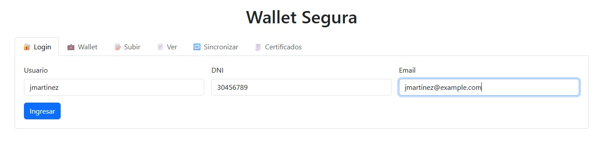
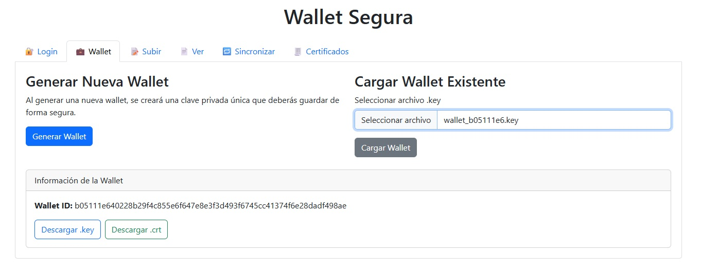
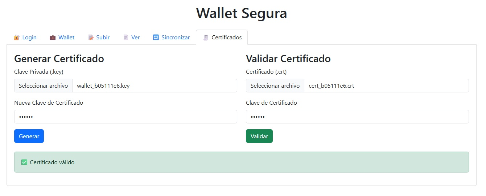
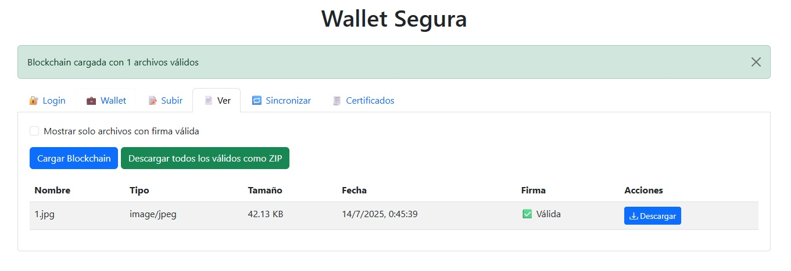
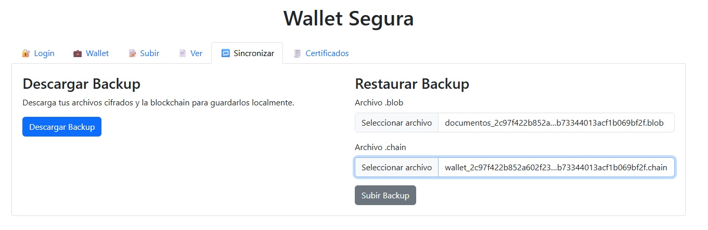

# 📁 Blockchain de Documentos con Wallets Seguras

Este proyecto implementa un sistema de almacenamiento y trazabilidad de documentos basado en tecnología tipo **blockchain**, con mecanismos de seguridad mediante **wallets** protegidas por certificados.

## 🔐 Características principales

- **Wallets seguras** creadas con:
  - Clave privada (`.key`)
  - Certificado público (`.crt`)
  - Contraseña de acceso

- **Firma digital de documentos** al momento de la carga

- **Blockchain de archivos**: cada documento se enlaza al anterior mediante su hash, asegurando integridad y trazabilidad

- **Sistema de verificación** de autenticidad basado en certificados

- **Recuperación de wallet** ante pérdida de archivos originales (clave derivada desde la semilla)

## 🧠 Aplicaciones

Ideal para:
- Organismos que manejan documentación sensible
- Firmas legales o notariales
- Instituciones académicas
- Empresas que requieren prueba de integridad documental

## 🛠️ Requisitos

- Servidor PHP 7.4+
- Extensión OpenSSL habilitada
- Navegador compatible con WebCrypto API

## 📂 Estructura

- `index.php` → Interfaz principal de carga y firma de archivos
- `wallet.chain` → Registro encadenado de documentos (blockchain)
- `.key`, `.crt` → Archivos de clave y certificado asociados a cada wallet
- `.blob` → Contenido cifrado de los archivos firmados

## 💬 Contacto

Proyecto desarrollado por **Softmania / Cristian Osvaldo Carreño**

📧 [info@negociosimple.ar](mailto:info@negociosimple.ar)  
🌐 [www.negociosimple.com.ar](http://www.negociosimple.com.ar)

---

## Base de datos "wallet_segura"
CREATE TABLE `usuarios` (
  `id` int(11) NOT NULL AUTO_INCREMENT,
  `usuario` varchar(50) NOT NULL,
  `dni` varchar(8) NOT NULL,
  `email` varchar(100) NOT NULL,
  `fecha_registro` timestamp NOT NULL DEFAULT current_timestamp(),
  PRIMARY KEY (`id`),
  UNIQUE KEY `usuario` (`usuario`,`dni`,`email`)
) ENGINE=InnoDB DEFAULT CHARSET=utf8mb4 COLLATE=utf8mb4_unicode_ci;

INSERT INTO usuarios (usuario, dni, email)
VALUES
  ('jmartinez', '30456789', 'jmartinez@example.com'),
  ('mgomez', '27890123', 'mgomez@example.com'),
  ('lrodriguez', '31876543', 'lrodriguez@example.com'),
  ('csuarez', '29543210', 'csuarez@example.com'),
  ('anavarro', '30123456', 'anavarro@example.com');
### Pantalla de Login

### Generación y carga de Wallet

### Generar y validar certificado

### Subida de archivos cifrados

### Verificación y descarga desde blockchain

### Backup y restauración

**⚠️ Este proyecto está en desarrollo y no debe usarse aún en entornos productivos sin revisión de seguridad.**
